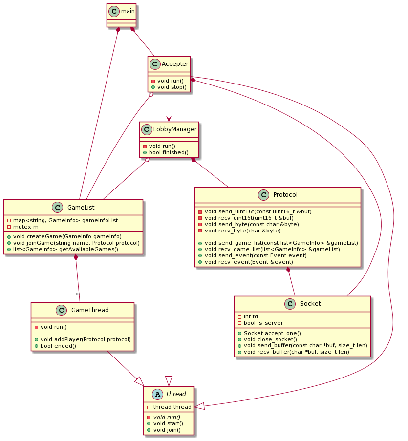
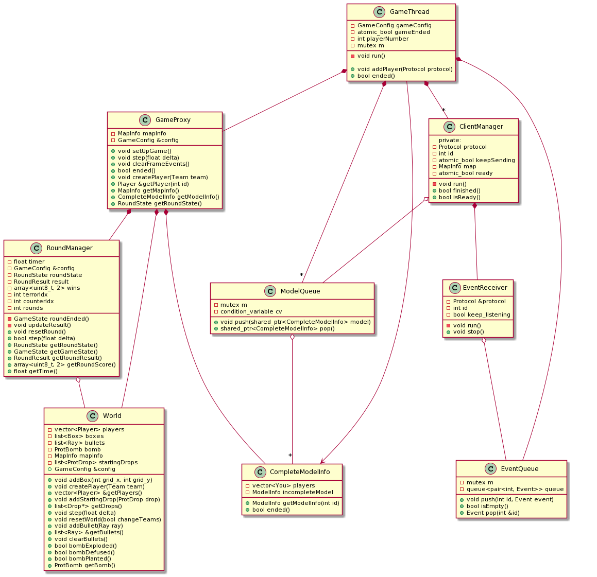
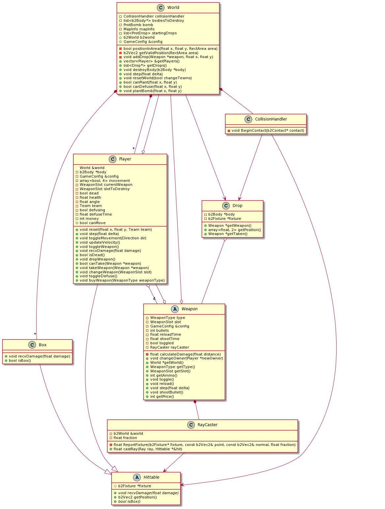

# Taller de Programación I - (75.42/95.08)
# Trabajo Práctico Final - Counter-Strike-2D -

# Documentación técnica

## Requerimientos de software

## Descripción general

El proyecto consta de 3 módulos principales. El Servidor, el Cliente, y el Editor.

### Editor
El editor se encarga de editar o crear mapas implementando *drag and drop*, *point and click*, varios menús distintos con textos claros para ser *user friendly* y  utilizando la librería SDL para renderizar las texturas.

### Cliente
El cliente se encarga de la interacción con el usuario, ya sea para unirse al servidor, tanto como para recibir la información actualizada del juego, y mediante una interfaz gráfica adecuada, mostrarsela al jugador.

### Server
El servidor es el programa encargado de mantener las partidas funcionando. Todos los clientes mandan las acciones que quieren realizar y el servidor les responde a todos con un modelo de juego actualizado. El servidor tiene que poder soportar múltiples partidas con varios jugadores cada una.

## Editor

### EventLoop
Dentro del main se encuentra el principal *event loop* el cual crea un stack de la clase `Presenter` para facilitar la navegación entre menús.

### MenuManager
Esta clase es la encargada de conectar los cambios de los distintos menús para luego guardar el mapa en un archivo yaml. En última instancia es el que renderiza y maneja los eventos del mapa a editar.

### TextureFactory
Clase encargada de abrir los archivos de formato yaml y generar objetos con los valores leídos.

### Presenter
Clase padre de los menús el cual cumple la función de proxy delegando su comportamiento a `MenuManager`.

### InitialMenu
Primer menú que da como opción de edición los mapas que se crearon hasta el momento y también da como opción crear un mapa.

### Editor
Clase que se encarga de maneja los evento del usuario sobre el editor de mapas y lo actualiza según los cambios dados.

### OptionsMenu
Menú de opciones donde el usuario puede modificar los tamaños tanto del mapa como de las zonas de aparición o de bombas.

### QuitMenu
Menú que interrumpe al usuario al cerrar el editor si tiene cambios no guardados, dándole la opción de hacerlo.

###TextureScreen
Encargada de mostrar todas las texturas que se encuentran en el programa, dividiéndolas en pisos, paredes y armas y manejar los eventos para la selección de la textura a ingresar.

## Cliente

### Character

Se encarga de la representación básica de un jugador en el motor gráfico. Permite, actualizar la información del mismo, y renderizarlo.

### Weapon

Esta clase nos permite la representación gráfica de las armas, independientemente del tipo, con sus respectiva animación.

### MainCharacter

Es una clase que hereda de la clase `Character`, la cual difiera de esta, ya que `MainCharacter` cuenta con un `Stencil` y una `CrossHair`. Es decir, contiene más información que la clase `Character`, y permite lo mismo.

### Stencil

Clase que otorga el comportamiento esperado de la técnica de dibujo stencil.

### CrossHair

Clase que brinda la renderización de la mira del personaje.

#### Ilustación de como se relacionan las clases

### GameManager

Tiene como responsabilidad traducir lo que manda el servidor. Traduce de metros a pixeles, tiene dos métodos importantes, los cuales son **initializeLevel** y **updatedLevel**.

### GameViewer

Esta clase es el eje principal de toda la interfaz de usuario, actualiza toda la información del juego, segun el nuevo modelo que se le mande, y por otro lado tambien se encarga de renderizar y mostrar todo lo que pasa al usuario.

### ParticleBullets

Otorga el comportamiento para renderizar las balas.

### SoundEffects

Esta clase se encarga de cargar todos los sonidos a través de yamls, y brinda los métodos correspondiente para reproducirlos.

### TextureManager

Tiene un comportamiento similar a `SoundEffects`, pero con texturas, las carga desde yamls, y se encarga de destruirlas.

### EventManager

Clase que se encarga del envío de eventos del jugador, en un hilo diferente.

### GameMath

Esta clase encapsula ciertos calculos que se hacen durante la traducción de metros a pixeles.

### Menus

Este paquete se encarga del todo el comportamiento de interacción con el usuario, como unirse al servidor, crear o unirse a una partida, todo lo previo a comenzar el juego.

### GameLoop

Según todas las clases comentadas, se deja una ilustración de como seria el GameLoop

## Servidor

### Accepter
La clase `Accepter` se encarga de aceptar las conexiones de todos los clientes. Cuando se conecta un nuevo cliente se lo pasa al LobbyManager para que realice toda la comunicación y poder continuar aceptando.

### LobbyManager
Se comunica con el usuario para crear partidas nuevas o unirse a ya existentes. Una vez que el cliente toma una decisión el `ClientManager` toma las riendas para la comunicación dentro del juego.

### ClientManager
Su trabajo es enviarle al usuario el modelo actualizado cada frame. Los modelos son extraídos de una cola (`ModelQueue`) y enviados usando la clase `Protocol`.

### ModelQueue
Cola bloqueante que contiene los snapshots del modelo para cada frame. Estos modelos son insertados por `GameThread` y extraídos por `ClientManager`.

### EventReceiver
El hilo encargado de recibir los eventos de un cliente. Todos los eventos recibidos son insertados en la `EventQueue` para ser procesados por el `EventHandler` dentro de `GameThread`.

### EventQueue
Contiene los eventos recibidos por **todos** los clientes.

### GameList
Guarda todas las partidas creadas (objetos de tipo `GameThread`) con su respectivo nombre y datos. Permite ver cuales son las partidas disponibles para unirse.

### GameThread
Representa una partida en juego. Contiene contiene el game loop de parte del servidor. El ciclo consta en procesar todos los eventos posibles en el tiempo establecido para un frame, actualizar el modelo y enviárselo a todos los clientes para que lo puedan mostrar. Interactúa con el modelo del juego a través de la clase `GameProxy`.

### GameProxy
Proporciona una interfáz más simple para interactuar con el modelo del juego. Además trabaja junto con la clase `World` para proporcionar "snapshots" del modelo en cada frame que puedan ser enviados según el protocolo.

### RoundManager
Es el encargado de estructurar las partidas en forma de rondas. Chequea constantemente si alguna de las condiciones de victoria se cumplieron para pasar a la siguiente ronda.

### CompleteModelInfo
Es generado por `GameProxy` y contiene un snapshot del modelo para un frame. Genera información personalizada para cada cliente necesaria de todos los jugadores puedan ver el juego desde su perspectiva.

### WorldParser
Parsesa el archivo yaml que representa al mapa de juego. Este archivo fue creado por el editor y contiene toda la información necesaria para crear un objeto de tipo `World`.

### EventHandler
Contiene las acciones que se deben llevar a cabo para cada evento.

### World
Es la clase que contiene todo el modelo del juego. Se crea una variable de tipo b2World para que box2d pueda manejar toda la física y colisiones. Si se quiere agregar un nuevo elemento (jugador, caja o drop) hay que pedirle a World que lo cree y lo agregue al mundo de box2d. La clase por si sola no simula ningún movimiento ni colisión, hay que usar la función `step` para "avanzar el tiempo" y mover los elementos.

### Hittable
Una clase abstracta que representa un elemento que puede bloquear balas y recibir daño. Las clases que heredan de `Hittable` son `Player` y `Box`. Cada cuerpo de box2d (`b2Body`) que representa a un jugador/caja tiene un objeto de esta clase adentro suyo.

### Player
Representa un jugador en la partida. Puede moverse, disparar, rotar, agarrar/soltar armas, etc. Cada jugador tiene un equipo designado (terrorista o antiterrorista) y cada equipo puede realizar acciones diferentes. Tiene cuatro lugares para armas, cada uno designado para un tipo de arma específico.

### Box
Las cajas son elementos estáticos (no se mueven) que frenan el movimiento de los jugadores. Pueden bloquear balas y son indestructibles.

### Drop
Los drops son las armas que están en el piso que cualquier jugador puede agarrar. Los jugadores también pueden soltar las armas que tienen en la mano para que otro jugador la pueda usar.

### CollisionHandler
Esta clase detecta las colisiones entre jugadores y drops para poder llevar a cabo el proceso de recoger un arma del piso.

### Weapon
Clase abstracta que representa un arma en el juego. Implementa la mayoría de las acciones que puede hacer un arma (disparar, recargar, etc.) pero sus clases hija pueden sobreescribir estas implementaciones para comportarse de diferentes maneras. Las clases que heredan de `Weapon` son `Knife`, `Pistol`, `Sniper`, `Shotgun`, `Rifle` y `Bomb`.

### RayCaster
Esta es la clase que ayuda a `Weapon` a encontrar el `Hittable` en su línea de disparo para que puedan recibir el daño de la bala.

### GameConfig
La clase `GameConfig` tiene todos los valores configurables del juego. Cosas como el daño de cada arma, la velocidad del jugador, el tiempo de cada ronda, etc. Todos estos datos son leídos de un archivo llamado `GameConfig.yaml` y son utilizados por la mayoría de las clases del juego.

### EntityChecker
Una clase auxiliar que permite ver si hay elementos en alguna parte del mapa. Se usa para asegurarnos que todos los jugadores aparezcan correctamente espaciados sin pisarse.

## Protocolo

El protocolo de comunicación entre el cliente y el servidor es bastante simple. El cliente envía eventos al servidor para que realice ciertas acciones y el servidor puede responder con diferentes mensajes.

### Lobby inicial
Cada cliente nuevo es atendido en un lobby en el que puede crear/unirse/listar partidas. El cliente envía un evento con la acción que quiere realizar y si la acción implica entrar en una partida (crear o unirse) el cliente queda esperando a recibir un `MapInfo`, indicando que la partida éstá por empezar. En el caso de que el cliente quiera listar las partidas también tiene un evento para hacerlo y en ese caso el servidor envía una lista de `GameInfo` con toda la información necesaria de cada partida disponible.

### Partida
Si el cliente entra en una partida (ya sea nueva o existente) tiene que esperar a que se llene para que empiece. En el momento que la partida se llena el servidor envía a todos los clientes un `MapInfo` que toda la información del mapa. Estos son datos que se mantienen constantes por toda la partida, cosas como el tamaño del mapa o la textura que tiene que ir en cada posición.
Luego del `MapInfo` se envía un `ModelInfo` que contiene un primer "snapshot" del estado de la partida. Cuando el cliente recibe estas dos cosas se pone a inicializar todas sus clases y una vez que está listo le envía al servidor un evento de tipo `CLIENT_READY`. Cuando todos los clientes están listos empieza la partida.
Durante la partida el protocolo es siempre el mismo. El servidor envía un `ModelInfo` por frame que contiene toda la información que puede cambiar (posiciones de los jugadores/drops, todas las balas disparadas, el estado de la partida, etc.). El cliente recibe estos datos y los muestra por pantalla. De forma asincrónica el cliente escucha los inputs del usuario y si alguno representa una acción entonces se envía el evento apropiado con la información necesaria. Estos eventos son todas las acciones que puede realizar un jugador (moverse, disparar, rotar, etc.). El servidor recibe todos estos eventos y los pone en una cola para ser procesados entre frame y frame. Al finalizar la partida simplemente se cambia la variable `gameEnded` a `true` (esta variable está incluída en `ModelInfo`) y se termina la comunicación.

### Clases
Las clases que forman parte del protocolo son las siguientes:

### Socket
Esta clase provee una abstracción del manejo de los sockets básicos. Puede crear/aceptar conexiones y mandar segmentos de información de forma segura.

### Protocol
Contiene métodos para enviar todas las estructuras más complejas que se necesitan. Sabe como enviar y recibir eventos, modelos, mapas, etc. Además tiene métodos internos para mandar tipos de datos más básicos como `float`, `uint16_t` o `byte`.

### Event
Los eventos son enviados por el cliente y recibidos por el servidor. Hay muchos tipos de eventos que se usan para cada acción que quiere realizar el cliente como mover al jugador, crear partidas, notificar, etc.

### MapInfo
Tiene toda la información que se mantiene constante a lo largo de la partida. El `MapInfo` se envía **una sola vez** al principio. Contiene información como el tamaño del mapa, las texturas para cada posición, los puntos de las bombas.

### ModelInfo
Contiene un "snapshot" del modelo para un frame específico. Tiene la posición de todos los jugadores, que armas están usando en el momento, la vida y munición del usuario, etc.

### GameInfo
Se usa para pasarle al cliente la información de cada partida disponible. Contiene el nombre, mapa, cantidad de jugadores.

### TextureMap
Lee un archivo yaml que contiene las direcciones de las texturas de cada casillero (tile). La clase guarda toda esta información en un diccionario que puede ser indexeado con el código de cada tile.
